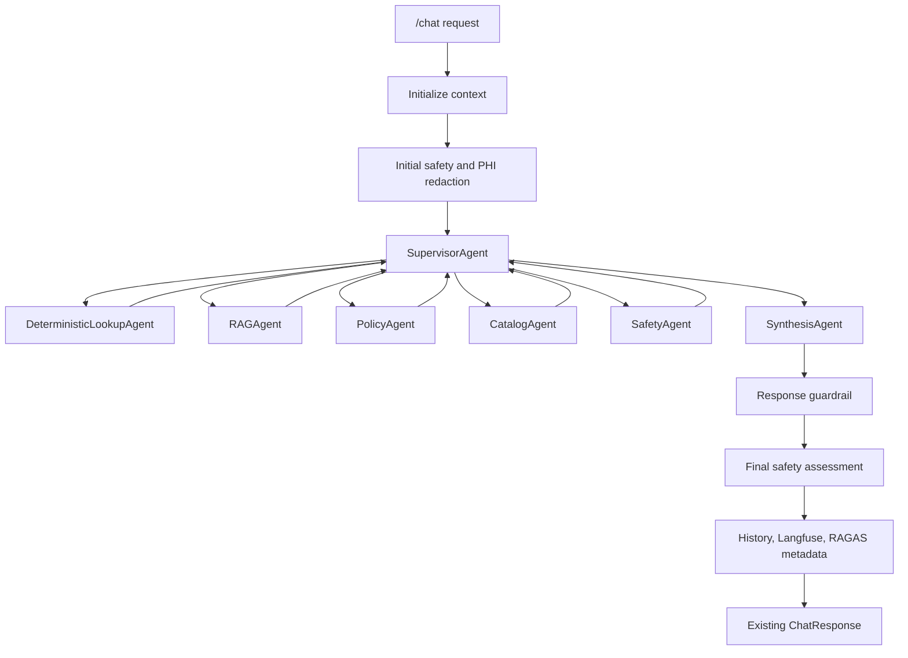

# Multi-Agent Conversion Implementation Plan

## Summary

Convert the current single-agent `KnowledgeAgent` into a supervisor-led multi-agent LangGraph workflow while keeping the public `/chat` API stable.

The goal is to preserve all existing behavior, including deterministic lookup, catalog-guided RAG, policy search, safety checks, Langfuse tracing, RAGAS scoring, dashboard metadata, local/AWS modes, and chat history, while making the internal agent flow clearer, more testable, and easier to extend.

## Target Architecture

Use a supervisor graph as the main execution model:



## Specialist Agents

### SupervisorAgent

The supervisor decides which specialist agent should run next and when enough evidence exists for synthesis.

Routing rules:

- Deterministic facts, CSV rows, counts, lists, rota, ward, contact, formulary, patient, and appointment queries go to `DeterministicLookupAgent`.
- General indexed document questions go to `RAGAgent`.
- Policy, SOP, pathway, guideline, compliance, and governance questions go to `PolicyAgent`.
- Questions asking what documents or policies exist, where a document is, or who owns a document go to `CatalogAgent`.
- PHI, urgent clinical risk, unsafe medical advice, or escalation-sensitive queries go to `SafetyAgent`.
- Multipart questions can call multiple specialists before synthesis.

### DeterministicLookupAgent

Wrap the existing deterministic lookup behavior:

- Postgres healthcare tables.
- Uploaded CSV row lookup through `uploaded_lookup_rows`.
- Row-value search.
- Count/list intent.
- Structured output preservation.

In `deterministic_agent` mode, high-confidence deterministic preflight remains a no-extra-LLM fast path.

In `agent_only` mode, deterministic preflight is skipped, but the supervisor may still route to this specialist.

### RAGAgent

Wrap general catalog-guided RAG:

- Uses existing `rag_search` behavior.
- Uses catalog narrowing when possible.
- Searches OpenSearch in AWS mode or ChromaDB in local mode.
- Preserves source snippets and citations.

### PolicyAgent

Wrap policy-specific retrieval:

- Uses existing `policy_search` behavior.
- Prefers metadata domains and document types such as policy, SOP, pathway, guideline, compliance, clinical policy, and admin policy.
- Falls back to broad retrieval when no catalog candidates match.

### CatalogAgent

Wrap document catalog behavior:

- Answers catalog inventory questions.
- Returns document lists, document metadata, owners, roles, types, and categories.
- Continues to support internal helper behavior for catalog-guided RAG.

### SafetyAgent

Wrap safety behavior:

- PHI and redaction context.
- Urgent clinical risk detection.
- Missing-source and escalation checks.
- Final safety outcome remains part of response metadata.

### SynthesisAgent

Produces the final answer from specialist outputs:

- Uses specialist outputs as the only evidence.
- Preserves exact deterministic values.
- Cites document sources when present.
- States what is missing when specialists return no evidence.
- Keeps a professional, neutral, concise style.

## Public API Compatibility

Do not change the top-level `/chat` request or response schema.

Keep:

- `ChatRequest.query`
- `ChatRequest.session_id`
- `ChatRequest.execution_mode`
- `ChatResponse.answer`
- `ChatResponse.sources`
- `ChatResponse.tools_used`
- `ChatResponse.trace_id`
- `ChatResponse.performance`
- `ChatResponse.latency_breakdown`

Add multi-agent details only inside metadata, performance, saved history, Langfuse traces, and dashboard rows.

New metadata fields:

- `agent_flow`
- `agents_used`
- `supervisor_decisions`
- `agent_latencies_ms`
- `agent_errors`

Keep `tools_used` as actual backend/tool calls, not specialist names.

Use `agent_flow` for specialist steps and supervisor decisions.

## Internal Result Contract

Each specialist should return a common internal result shape:

```python
{
    "agent_name": "PolicyAgent",
    "status": "ok | no_evidence | failed",
    "answer_fragment": "...",
    "tool_context": "...",
    "sources": [],
    "tools_used": [],
    "tool_flow": [],
    "performance": {},
    "errors": []
}
```

The final graph result should still be converted into the existing `GraphAgentResult` shape:

- `answer`
- `sources`
- `tools_used`
- `tool_context`
- `catalog_guidance`
- `performance`

## Execution Modes

### `deterministic_agent`

Preserve current behavior:

- Run deterministic preflight for high-confidence structured queries.
- Use fast RAG when applicable.
- Use supervisor graph when preflight and fast paths do not answer.

### `agent_only`

Preserve current meaning:

- Skip deterministic preflight.
- Skip direct deterministic fast paths.
- Start the supervisor graph.
- Allow the supervisor to route to `DeterministicLookupAgent` when appropriate.

## LangGraph Design

Graph state should include:

- query
- redacted query
- user context
- history context
- system prompt
- initial safety assessment
- specialist outputs
- sources
- tools used
- tool flow
- agent flow
- performance
- errors
- step count

Graph flow:

1. Initialize context.
2. Run initial safety and PHI redaction outside the specialist graph.
3. Supervisor selects next specialist.
4. Specialist runs and appends result to graph state.
5. Supervisor decides whether another specialist is needed.
6. Stop after enough evidence exists or after the max step limit.
7. Synthesis agent produces final answer.
8. Existing guardrail and final safety assessment run.
9. Existing trace, history, RAGAS, and dashboard metadata are updated.

Limits:

- Keep existing max LLM call behavior.
- Add a max agent-step limit to prevent routing loops.
- If the limit is reached, synthesize from accumulated evidence.

## Metadata And Dashboard

Keep existing metadata:

- `tools_used`
- `tool_flow`
- `source_document_keys`
- `chat_execution_mode`
- `agent_mode`
- `latency_breakdown`
- `ragas`

Add:

- `agent_flow`: ordered list of supervisor and specialist steps.
- `agents_used`: unique list of specialist agents.
- `supervisor_decisions`: compact routing decisions and reasons.
- `agent_latencies_ms`: per-agent latency map.

Dashboard updates:

- Show agents used in the per-query table or expander.
- Keep existing tool flow display.
- Show supervisor/specialist sequence in each query expander.

## Implementation Steps

1. Introduce internal specialist result types and graph state types.
2. Extract deterministic preflight into `DeterministicLookupAgent`.
3. Extract RAG, policy, catalog, and safety behavior into specialist wrappers around existing tools/services.
4. Replace the current single-node LangGraph wrapper with a real supervisor graph.
5. Preserve current fast paths in `deterministic_agent` mode.
6. Add supervisor graph path for `agent_only` mode.
7. Add metadata fields for agent flow and per-agent latency.
8. Update dashboard metadata parsing to display agent flow.
9. Add tests for routing, compatibility, metadata, and regression behavior.

## Test Plan

### Unit Tests

- Deterministic row-value questions route to `DeterministicLookupAgent`.
- Policy questions route to `PolicyAgent`.
- Catalog questions route to `CatalogAgent`.
- General document questions route to `RAGAgent`.
- Safety-sensitive questions route to `SafetyAgent`.
- Multipart questions call multiple specialists and synthesize one answer.
- `deterministic_agent` keeps deterministic preflight behavior.
- `agent_only` skips deterministic preflight but can still route to deterministic lookup through the supervisor.
- `tools_used` remains backend/tool calls.
- `agent_flow` records supervisor and specialist steps.
- Loop limit produces a final answer instead of hanging.

### API And Dashboard Tests

- `/chat` request schema remains backward compatible.
- `/chat` response schema remains backward compatible.
- Saved message metadata includes `agent_flow`, `agents_used`, and `chat_execution_mode`.
- Dashboard rows expose agent flow from metadata.
- Existing mode selector still sends `execution_mode`.

### Regression Tests

- User management.
- Document upload, metadata edit, ingest, and delete-index flow.
- Local Chroma mode.
- AWS OpenSearch mode.
- Deterministic CSV lookup.
- Catalog-guided RAG.
- Langfuse trace creation.
- Background RAGAS scoring.
- Safety guardrails.

Run:

```bash
python -m pytest tests -q
python -m compileall backend frontend tests -q
```

Docker equivalent:

```bash
docker compose run --rm -v "${PWD}:/workspace" -w /workspace backend python -m pytest tests -q
docker compose run --rm -v "${PWD}:/workspace" -w /workspace backend python -m compileall backend frontend tests -q
```

## Assumptions

- Multi-agent means multiple specialist agents inside one backend LangGraph workflow.
- No separate services or deployments are introduced.
- `/chat` remains the only chat endpoint.
- Top-level public API fields do not change.
- Existing latency optimizations should be preserved where possible.
- Langfuse and dashboard visibility come from metadata, not API schema changes.

