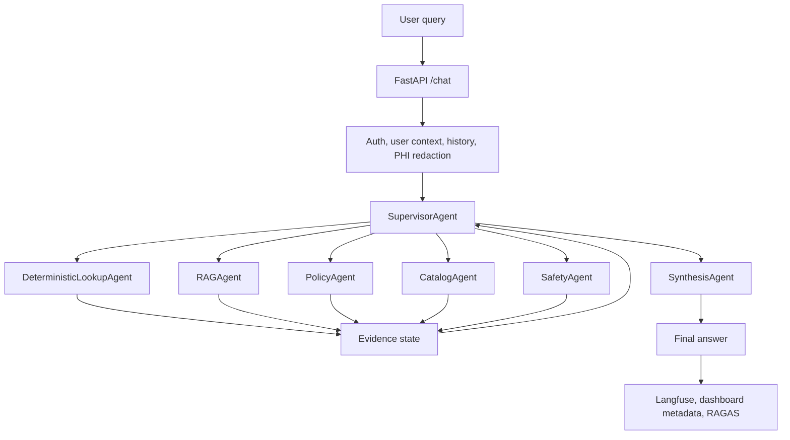

# Multi-Agent Conversion Proposal

## Executive Summary

The Healthcare Knowledge Agent currently works as a single agent that performs routing, retrieval, deterministic lookup, safety handling, answer synthesis, tracing, and metadata generation in one orchestration layer.

This proposal recommends converting the system to a supervisor-led multi-agent architecture. The new design keeps the existing user experience and `/chat` API stable while improving routing clarity, testability, observability, and future extensibility.

## Domain

The system operates in the healthcare knowledge and operations domain.

It supports:

- Healthcare policy Q&A.
- Operational document search.
- Staff rota and contact lookup.
- Ward, department, appointment, patient, and formulary lookup.
- Uploaded CSV row lookup.
- Safety-aware responses for PHI and urgent clinical-risk queries.
- Admin visibility through dashboard traces and evaluation scores.

The domain requires professional, traceable, and source-grounded responses. Answers often need to combine free-text policy evidence with exact structured data from Postgres or uploaded CSV rows.

## Business Problem

The current single-agent design has become capable but overloaded.

Main problems:

- Routing ambiguity: one agent must decide between deterministic lookup, RAG, policy search, catalog search, safety handling, and synthesis.
- Inconsistent tool choice: similar questions can take different paths when the single agent interprets them differently.
- Latency tradeoffs: direct deterministic paths are fast, but broad LLM routing can add latency.
- Auditability: tools are traced, but business stakeholders also need to understand which domain agent handled each part of a query.
- Testing complexity: one large agent is harder to test than smaller specialist behaviors.
- Extensibility limits: adding new domains, such as pharmacy, clinical engineering, HR, or finance, becomes riskier when all logic sits in one orchestration path.

## Proposed Solution

Introduce a supervisor-led multi-agent LangGraph workflow.

The supervisor decides which specialist should handle the query or query segment. Specialist agents execute domain-specific logic, return structured evidence, and the synthesis agent creates the final answer.

The public chat contract stays unchanged. The multi-agent behavior is visible through Langfuse traces, dashboard metadata, and saved chat metadata.

## Proposed Agent Roles

### SupervisorAgent

Coordinates the workflow.

Responsibilities:

- Interpret user intent.
- Route to the right specialist.
- Decide whether multiple specialists are needed.
- Stop when enough evidence exists.
- Send accumulated evidence to the synthesis agent.

### DeterministicLookupAgent

Handles structured and exact data.

Responsibilities:

- Postgres healthcare tables.
- Uploaded CSV lookup rows.
- Count and list questions.
- Row-value search.
- Rota, contact, ward, department, formulary, patient, and appointment lookup.

### RAGAgent

Handles general document retrieval.

Responsibilities:

- Catalog-guided RAG.
- OpenSearch retrieval in AWS mode.
- ChromaDB retrieval in local mode.
- Source snippets and citations.

### PolicyAgent

Handles policies, SOPs, pathways, guidelines, compliance, and governance questions.

Responsibilities:

- Prefer policy-like documents using metadata.
- Summarize policy requirements.
- Cite policy sources.

### CatalogAgent

Handles document inventory and metadata questions.

Responsibilities:

- List available documents and policies.
- Return document categories, owners, types, roles, and metadata.
- Continue supporting catalog-assisted RAG narrowing.

### SafetyAgent

Handles safety and governance concerns.

Responsibilities:

- PHI detection and redaction context.
- Urgent clinical risk.
- Missing-source handling.
- Escalation-sensitive responses.

### SynthesisAgent

Creates the final response.

Responsibilities:

- Combine specialist outputs.
- Preserve exact deterministic facts.
- Cite document sources.
- State what is missing when evidence is insufficient.
- Maintain professional, neutral, concise tone.

## Technology Used

The conversion builds on the existing stack:

- FastAPI for backend APIs.
- Streamlit for frontend pages.
- LangGraph for multi-agent workflow orchestration.
- LangChain Azure OpenAI integrations for chat models, embeddings, messages, and tool compatibility.
- Azure OpenAI for LLM and embedding deployments.
- OpenSearch Serverless for AWS vector and keyword retrieval.
- Postgres for healthcare structured data, uploaded CSV rows, chat history, and dashboard support.
- S3 for AWS document storage and manifests.
- Langfuse for traces, prompt management, token metadata, tool flow, and scores.
- RAGAS for background and offline answer evaluation.

## Target Workflow

## Expected Benefits

- Clearer routing between structured lookup, RAG, policy, catalog, and safety behavior.
- More reliable answers for domain-specific questions.
- Better traceability through `agent_flow`.
- Easier dashboard explanation for each query.
- Easier unit testing of individual specialists.
- Lower regression risk when adding new domain capabilities.
- Better future extensibility for additional departments or specialized workflows.

## Success Criteria

The conversion is successful when:

- `/chat` request and response shape remain unchanged.
- Existing frontend behavior continues to work.
- Deterministic lookup, RAG, policy search, catalog search, and safety behavior still work.
- `agent_flow` is stored in metadata and visible in the dashboard.
- Langfuse traces show the supervisor and specialist flow.
- RAGAS scoring continues to run in the background.
- Existing tests pass.
- New tests prove supervisor routing and specialist behavior.

## Recommended Implementation Strategy

Implement this in phases:

1. Add internal specialist result contracts and metadata fields.
2. Extract current deterministic, RAG, policy, catalog, and safety behavior into specialist wrappers.
3. Replace the current single-node LangGraph wrapper with the supervisor graph.
4. Preserve current fast paths and execution modes.
5. Add dashboard display for `agent_flow`.
6. Add tests for routing, metadata, API compatibility, and regression behavior.

This approach minimizes user-facing change while improving the internal architecture.

