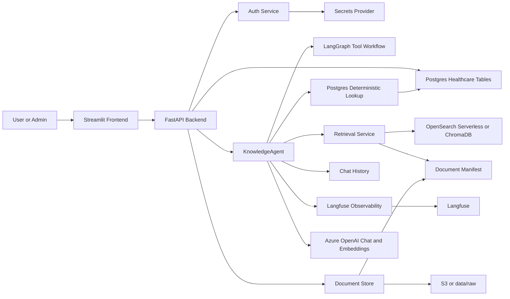
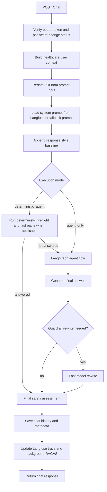
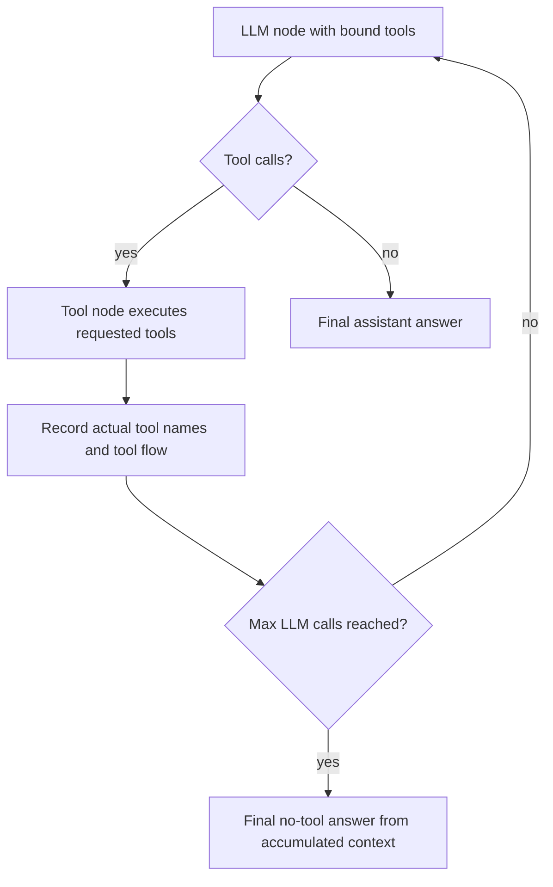
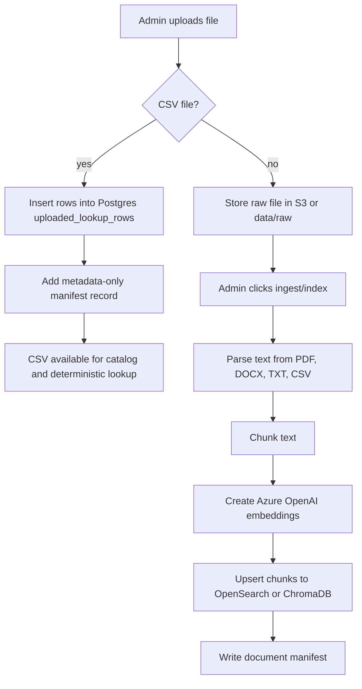

# Healthcare Knowledge Agent System Summary

Generated for the `dstrmaysam-healthcare-knowledge-agent` project.

## 1. Overview

The Healthcare Knowledge Agent is a containerized internal assistant for healthcare knowledge, policy, operational lookup, document search, and admin monitoring. It combines:

- A Streamlit frontend for chat, document administration, user administration, patient details, and dashboards.
- A FastAPI backend for authentication, chat orchestration, document ingestion, deterministic lookup, tracing, and admin APIs.
- LangGraph agent execution with Azure OpenAI chat models through `langchain-openai`.
- Retrieval augmented generation over uploaded documents.
- Deterministic Postgres lookup for structured healthcare data and uploaded CSV rows.
- Langfuse tracing, prompt loading, dashboard metadata, and background RAGAS scoring.
- Two runtime modes:
  - Local mode: controlled by `LOCAL_TEST_ADMIN_ENABLED=true`.
  - AWS dev mode: controlled by `LOCAL_TEST_ADMIN_ENABLED=false`.

The system is designed so local development can use local files, ChromaDB, `.env` secrets, and Postgres chat history, while AWS dev uses S3, OpenSearch Serverless, Secrets Manager, IAM task roles, and the configured chat history backend.

## 2. Main Capabilities

- Authenticated chat with persistent sessions.
- Admin-created users, roles, departments, password reset, and first-login password change.
- Per-query execution mode:
  - `Deterministic + Agent`: deterministic preflight and optimized paths are allowed before agent fallback.
  - `Agent only`: skips deterministic preflight and starts LangGraph so the LLM chooses tools.
- Document upload and ingestion.
- Catalog-guided RAG for documents, policies, SOPs, pathways, and guidelines.
- Local vector storage using ChromaDB.
- AWS vector storage using OpenSearch Serverless.
- Structured lookup against Postgres healthcare tables.
- Uploaded CSV lookup rows stored in Postgres and exposed as metadata-only catalog assets.
- Admin document metadata editing for category, roles, and document type.
- Delete all indexes flow protected by admin password.
- Langfuse trace IDs, tool flow, latency, token metadata, model metadata, and RAGAS scores.
- Admin dashboard with range and user filters.
- Patient details dashboard over Postgres tables.
- RAGAS and stress-test scripts.

## 3. Runtime Modes

### Local Mode

Enabled when:

```env
LOCAL_TEST_ADMIN_ENABLED=true
```

Local mode uses:

- `EnvSecretProvider`
- `.env` values for Azure OpenAI and Langfuse
- `data/local_app_secret.json` for app auth users
- `data/raw/` for uploaded files
- `data/manifests/documents.json` for the document manifest
- ChromaDB under `data/chroma`
- Postgres for deterministic lookup and persistent chat history

Local mode ignores AWS S3, OpenSearch, DynamoDB, and Secrets Manager even if those values exist in `.env`.

### AWS Dev Mode

Enabled when:

```env
LOCAL_TEST_ADMIN_ENABLED=false
APP_ENV=dev
SECRETS_STAGE=dev
```

AWS dev mode uses:

- AWS Secrets Manager for app, Azure OpenAI, and Langfuse secrets.
- S3 for raw documents and the document manifest.
- OpenSearch Serverless for vector and keyword retrieval.
- DynamoDB, Postgres, or DynamoDB with Postgres fallback depending on `CHAT_HISTORY_BACKEND`.
- ECS task role credentials. AWS credentials should come from the ECS task role, not environment variables.

Important AWS dev names:

```env
S3_BUCKET=dstrmaysam-healthcare-knowledge-agent-dev
DYNAMODB_CHAT_TABLE=dstrmaysam-healthcare-knowledge-agent-dev
OPENSEARCH_INDEX=dstrmaysam-healthcare-knowledge-agent-dev
APP_SECRET_NAME=/dstrmaysam-healthcare-knowledge-agent/dev/app
AZURE_OPENAI_SECRET_NAME=/dstrmaysam-healthcare-knowledge-agent/dev/azure-openai
LANGFUSE_SECRET_NAME=/dstrmaysam-healthcare-knowledge-agent/dev/langfuse
```

## 4. High-Level Architecture



## 5. Frontend Workflow

The frontend is a Streamlit app. It contains pages for:

- Chat
- Dashboard
- Patient Details
- Documents
- Users

The chat page:

1. Reads the stored login session.
2. Lets the user choose `Deterministic + Agent` or `Agent only`.
3. Shows a local notice when the mode changes.
4. Sends the selected execution mode with every `/chat` request.
5. Keeps the query input fixed near the bottom of the chat window.
6. Shows progress messages while backend processing is happening.
7. Displays only the final assistant answer when processing is complete.

The Documents page:

1. Shows the document table at all times.
2. Allows admins to upload documents.
3. Allows CSV uploads to be stored as metadata-only catalog assets while their rows are inserted into Postgres.
4. Allows admins to edit category, access roles, and document type.
5. Allows admins to ingest and index documents.
6. Allows admins to delete all indexes after confirming their admin password.

The Dashboard page:

1. Loads recent chat interactions from history.
2. Filters by time range and user.
3. Shows aggregate latency, token, tool, RAGAS, model, and query details.
4. Shows per-query expanders with trace ID, mode, tools, tool flow, sources, and metadata.

## 6. Backend API Surface

Core endpoints:

- `POST /auth/login`
- `GET /auth/me`
- `POST /auth/change-password`
- `POST /chat`
- `GET /chat/sessions`
- `GET /chat/sessions/{session_id}`
- `GET /documents`
- `GET /health`
- `GET /news`

Admin endpoints:

- `GET /admin/users`
- `POST /admin/users`
- `PATCH /admin/users/{username}`
- `POST /admin/users/{username}/reset-password`
- `POST /admin/documents/upload`
- `PATCH /admin/documents/metadata`
- `POST /admin/documents/ingest`
- `POST /admin/documents/delete-indexes`
- `GET /admin/dashboard`
- `GET /admin/patient-details`
- `POST /admin/warmup`

## 7. Chat Request And Response Shape

Request:

```json
{
  "query": "How many ventilators do we have?",
  "session_id": "optional-existing-session-id",
  "execution_mode": "deterministic_agent"
}
```

Allowed execution modes:

- `deterministic_agent`
- `agent_only`

Response includes:

- `session_id`
- `answer`
- `sources`
- `tools_used`
- `input_tokens`
- `output_tokens`
- `latency_ms`
- `trace_id`
- `safety`
- `audit_event`
- `performance`
- `latency_breakdown`

Each source has:

- `title`
- `uri`
- `score`
- `metadata`
- `snippet`

The `snippet` field is important for citations, RAGAS context scoring, and dashboard drilldown.

## 8. Chat Workflow



## 9. Agent Workflow

The main agent lives in `KnowledgeAgent`. It uses LangGraph for tool-calling behavior and keeps deterministic safety outside the graph.

Key steps:

1. The backend creates or reuses a Langfuse root trace.
2. The system prompt is loaded from Langfuse when available.
3. Static response style requirements are appended to the prompt.
4. Prior chat history is included only for continuity, not as authoritative evidence for current operational facts.
5. In `deterministic_agent` mode, deterministic preflight may answer directly.
6. In `agent_only` mode, deterministic preflight is skipped.
7. LangGraph receives the current query, user context, tool list, and prompt.
8. The model chooses tools.
9. Tool calls are executed and recorded in `tools_used`.
10. Internal catalog assistance is recorded in `tool_flow` and metadata, but `tools_used` only records tools selected by the LLM or execution path.
11. The final answer is produced.
12. Safety, trace metadata, history, and RAGAS enrichment run after the answer path.



The graph loop is bounded by the `MAX_GRAPH_LLM_CALLS` environment setting. The current default is `2`, with a code-level fallback constant of `5`.

## 10. Agent Tools

### `rag_search`

General RAG search over indexed knowledge chunks. It is used by the base agent tool set for broad knowledge-base retrieval.

Workflow:

1. Load accessible document catalog records.
2. Match query terms against title, key, content type, and metadata.
3. Limit catalog candidates to the strongest matching document keys.
4. Search vector store using the query and candidate document key filter when available.
5. Merge vector and keyword hits.
6. Add neighbor chunks if configured.
7. Filter hits by user role and document access metadata.
8. Return snippets, titles, URIs, scores, and metadata.

### `document_search`

Healthcare document search over approved documents. It is similar to `rag_search`, but exposed as a healthcare-specific tool description so the LLM can choose it for ordinary document questions.

Workflow:

1. LLM chooses `document_search`.
2. Backend runs catalog-guided candidate selection internally.
3. Retrieval searches OpenSearch or ChromaDB.
4. Access control removes documents the user is not allowed to read.
5. Returned chunks are formatted as evidence for the final answer.

### `policy_search`

Focused search over clinical policies, admin policies, compliance documents, SOPs, pathways, and guidelines.

Workflow:

1. LLM chooses `policy_search`.
2. Catalog candidates are selected.
3. Policy-like records are preferred when metadata `domain` or `document_type` matches policy, SOP, pathway, guideline, clinical policy, admin policy, or compliance.
4. Retrieval is filtered to candidate keys when candidates exist.
5. Broad search is used if no candidates are found.
6. Access control and source formatting are applied.

### `catalogue_search`

Searches document catalog metadata rather than chunk text.

Workflow:

1. Load the document manifest.
2. Apply role-based document filtering.
3. Match query terms against metadata fields.
4. Return matching catalog records as JSON.

The catalog also acts as an internal helper for RAG narrowing. Internal catalog assistance is visible in `tool_flow`, not as a separate `tools_used` value unless the LLM explicitly calls `catalogue_search`.

### `postgres_deterministic_lookup`

Exact lookup over Postgres healthcare data and uploaded CSV rows.

Workflow:

1. Classify the query as patient, appointment, doctor, ward, department, contact, formulary, uploaded CSV row lookup, or directory lookup.
2. Build normalized search terms from the user query.
3. Apply access-level filtering using the current user's roles and departments.
4. Query the matching Postgres table or `uploaded_lookup_rows`.
5. For uploaded CSV rows, use full-text search over `searchable_text`, with fallback matching where needed.
6. Detect list and count intent.
7. Return exact rows, counts, matched terms, selected CSV assets, and lookup plan metadata.

Examples:

- "How many ventilators do we have?" searches uploaded CSV rows and returns exact counts plus location/status details.
- "List all equipment we have" returns unique equipment types from `equipment_assets.csv`.
- "Information on morphine" queries the formulary table and formats the selected medicine details.

### `calendar_rota_lookup`

Looks up calendar, clinic, training, on-call, and rota data. Staff availability and rota-style CSV questions prefer the Postgres deterministic lookup path.

### `formulary_table_lookup`

Looks up formulary rows, medicine restrictions, approval rules, and structured facts.

### `safety_guard`

Assesses clinical risk, missing sources, PHI exposure, and escalation needs.

## 11. Retrieval Strategy

Retrieval uses hybrid search:

- Vector search over embeddings.
- Keyword search over text, title, key, and metadata.
- OpenSearch multi-search when available.
- Parallel vector and keyword fallback when multi-search is not available.
- Neighbor chunk expansion using `RAG_NEIGHBOR_CHUNKS`.
- Catalog-guided document key filtering.
- Role-aware filtering after retrieval.

OpenSearch query behavior:

1. Embed the query with Azure OpenAI embeddings.
2. Run kNN vector search when embeddings are available.
3. Run keyword `multi_match`.
4. If catalog candidate keys exist, add a `terms` filter on `key`.
5. Merge duplicate hits.
6. Fetch neighbor chunks.
7. Return ranked `RetrievalHit` objects.

Local Chroma behavior:

1. Embed the query with Azure OpenAI embeddings.
2. Query the persistent Chroma collection.
3. Apply document key filtering when supplied.
4. Return the same `RetrievalHit` shape as OpenSearch.

## 12. Chunking Strategy

Document ingestion uses:

```env
INGESTION_CHUNK_SIZE=1500
INGESTION_CHUNK_OVERLAP=250
```

Implementation:

- Primary splitter: LangChain `RecursiveCharacterTextSplitter`.
- Fallback splitter: fixed-size sliding window over text.
- Minimum chunk size is clamped to `300`.
- Overlap is clamped so it cannot be equal to or larger than the chunk size.

Why this strategy is used:

- Recursive splitting tries to preserve natural boundaries before falling back to smaller text units.
- `1500` characters keeps chunks large enough to preserve local context such as policy clauses, headings, and paragraphs.
- `250` characters of overlap reduces the risk that an answer-critical sentence is split across two chunks.
- Moderate chunk size helps keep retrieval precise and avoids sending very large context payloads to the LLM.
- The fallback splitter keeps ingestion working even if the optional text splitter package fails.

Chunk records store:

- Document key
- Title
- URI
- Chunk text
- Content type
- Chunk index
- Checksum
- Metadata
- Embedding vector

## 13. Document Upload And Ingestion Workflow



Ingestion is incremental:

- Unchanged files are skipped by checksum.
- Changed files are deleted and reindexed.
- Removed files cause their chunks to be deleted.
- If the OpenSearch index or Chroma collection changes, the ingestion job forces reindexing.

CSV handling is special:

- Uploaded CSV rows are stored in Postgres as the source of truth.
- CSV manifest records are metadata-only and use `postgres://uploaded_lookup_rows/<filename>` URIs.
- CSV semantic metadata helps the agent and deterministic lookup choose the right uploaded CSV asset.
- Deleting indexes also deletes uploaded lookup rows.

## 14. Data Structures

### Postgres Healthcare Tables

Defined in `database/init/01_schema.sql`.

| Table | Purpose | Key fields |
| --- | --- | --- |
| `departments` | Department directory | `department_id`, `department_name`, `specialty_group`, `location`, `main_phone`, `service_lead`, `escalation_contact`, `access_level` |
| `doctors` | Doctor directory and on-call status | `doctor_id`, `full_name`, `grade`, `specialty`, `department_name`, `phone`, `email`, `bleep`, `on_call_today`, `access_level` |
| `wards` | Ward directory and capacity | `ward_code`, `ward_name`, `department_name`, `floor`, `bed_capacity`, `beds_available`, `nurse_in_charge`, `phone`, `access_level` |
| `patients` | Patient details | `patient_id`, `mrn`, `nhs_number`, `full_name`, `date_of_birth`, `ward_code`, `department_name`, `named_consultant`, `care_status`, `risk_flags`, `access_level` |
| `organization_contacts` | Escalation and contact directory | `contact_id`, `contact_type`, `department_name`, `contact_name`, `role`, `phone`, `email`, `available_hours`, `escalation_level`, `access_level` |
| `appointments` | Appointment lookup | `appointment_id`, `patient_mrn`, `patient_name`, `clinic_name`, `department_name`, `appointment_date`, `appointment_time`, `clinician_name`, `status`, `referral_priority`, `access_level` |
| `formulary` | Medicine and formulary facts | `medicine_id`, `medicine_name`, `category`, `restricted`, `approval_required`, `max_adult_dose`, `monitoring_required`, `access_level` |
| `uploaded_lookup_rows` | Uploaded CSV rows | `source_filename`, `row_number`, `row_data`, `searchable_text`, `access_level`, `uploaded_at` |

### Uploaded CSV Row Search

`uploaded_lookup_rows` stores:

- `source_filename`: CSV file name.
- `row_number`: original CSV row number.
- `row_data`: full row as JSONB.
- `searchable_text`: normalized text built from filename, column names, and row values.
- `access_level`: access scope.
- `uploaded_at`: insert timestamp.

Indexes:

- Full-text index on `to_tsvector('simple', searchable_text)`.
- Source and access indexes for filtering.

### Chat History In Postgres

Used in local mode and optionally as fallback in AWS mode.

`chat_sessions`:

- `user_id`
- `session_id`
- `title`
- `updated_at`

`chat_messages`:

- `message_id`
- `user_id`
- `session_id`
- `role`
- `content`
- `created_at`
- `metadata`

Important indexes:

- `(user_id, session_id, message_id)`
- `metadata->>'trace_id'`

### Langfuse Trace Outbox

`langfuse_trace_outbox` supports background trace enrichment:

- `id`
- `trace_id`
- `user_id`
- `session_id`
- `output`
- `metadata`
- `status`
- `retry_count`
- `last_error`
- `created_at`
- `updated_at`

### DynamoDB Chat History

AWS dev can use DynamoDB table:

```json
{
  "TableName": "dstrmaysam-healthcare-knowledge-agent-dev",
  "BillingMode": "PAY_PER_REQUEST",
  "KeySchema": [
    {"AttributeName": "user_id", "KeyType": "HASH"},
    {"AttributeName": "sort_key", "KeyType": "RANGE"}
  ]
}
```

Session rows use `SESSION#...` sort keys and message rows use `MESSAGE#...` sort keys.

### Document Manifest

The document manifest lives at:

- AWS mode: `s3://<S3_BUCKET>/<S3_MANIFEST_KEY>`
- Local mode: `data/manifests/documents.json`

Common fields:

- `documents`
- `indexed_chunks`
- `total_chunks`
- `indexed_documents`
- `skipped_documents`
- `deleted_documents`
- `deleted_chunks`

Each document record contains:

- `key`
- `title`
- `uri`
- `content_type`
- `checksum`
- `metadata`
- `chunk_count`
- `ingestion_status`

Local Chroma manifests also store:

- `vector_backend`
- `chroma_collection`
- `previous_vector_backend`
- `previous_chroma_collection`

AWS manifests also store:

- `opensearch_index`
- `previous_opensearch_index`

### Document Metadata

Typical metadata fields:

- `owner`
- `version`
- `effective_date`
- `review_date`
- `approval_status`
- `sensitivity`
- `domain`
- `document_type`
- `allowed_roles`
- `category`

CSV metadata-only assets can also include:

- `asset_source=postgres_uploaded_lookup`
- `source_table=uploaded_lookup_rows`
- `row_count`
- `columns`
- `semantic_terms`
- `categorical_values`
- `sample_values`

### OpenSearch Chunk Mapping

OpenSearch stores:

- `key`
- `title`
- `uri`
- `text`
- `content_type`
- `chunk_index`
- `checksum`
- `metadata`
- `embedding`

The vector field:

```json
{
  "type": "knn_vector",
  "dimension": 1536,
  "method": {
    "engine": "faiss",
    "name": "hnsw"
  }
}
```

### Chroma Chunk Metadata

Local Chroma chunks store:

- chunk document text
- embedding vector
- `key`
- `title`
- `uri`
- `chunk_index`
- `checksum`
- `content_type`
- flattened metadata fields
- `metadata_json`

### App Secret Shape

The app secret contains:

```json
{
  "session_secret": "...",
  "auth_users": {
    "admin": "password-hash"
  },
  "user_profiles": {
    "admin": {
      "roles": ["admin"],
      "departments": ["operations"],
      "password_change_required": false
    }
  }
}
```

Local mode persists this structure in `data/local_app_secret.json`.

AWS mode persists it in Secrets Manager.

## 15. Access Control

Users have:

- `roles`
- `departments`
- `password_change_required`

Document metadata can include `allowed_roles`.

If a document has an `allowed_roles` list, the user must have at least one matching role to access it. If the list is empty or absent, the document is broadly accessible subject to the rest of the access-control checks.

Structured Postgres rows use `access_level` values. The deterministic lookup service converts the user context into allowed access scopes and applies filtering before returning rows.

## 16. Traces, Metadata, And Dashboard Fields

Langfuse and saved chat metadata include:

- `trace_id`
- `user_id`
- `session_id`
- `chat_execution_mode`
- `chat_execution_mode_label`
- `agent_mode`
- `tools_used`
- `tool_flow`
- `model`
- `prompt_label`
- `input_tokens`
- `output_tokens`
- `latency_ms`
- `latency_breakdown`
- `sources`
- `source_count`
- `source_document_keys`
- `ragas_status`
- `ragas_scores`
- `safety`
- `audit_event`

Tool flow is more detailed than `tools_used`. For example, if `rag_search` internally used the document catalog to narrow candidates, `tools_used` may show only `rag_search`, while `tool_flow` shows the catalog-assisted step.

## 17. Caching And Latency Features

The system uses several short-lived caches:

- Document manifest cache: controlled by `DOCUMENT_MANIFEST_CACHE_TTL_SECONDS`.
- Langfuse prompt cache: controlled by `LANGFUSE_PROMPT_CACHE_TTL_SECONDS`.
- Query embedding cache: controlled by `RAG_EMBEDDING_CACHE_SIZE`.
- Retrieval result cache: controlled by `RAG_QUERY_CACHE_TTL_SECONDS`.
- Catalog candidate cache inside the agent.

Warmup settings:

```env
CHAT_WARMUP_ENABLED=true
CHAT_WARMUP_LLM_CALL_ENABLED=false
CHAT_WARMUP_RETRIEVAL_ENABLED=true
```

`CHAT_WARMUP_LLM_CALL_ENABLED=false` means the backend warmup avoids a paid or latency-producing LLM call. It can still initialize local services and retrieval paths when warmup is enabled.

Background settings:

```env
CHAT_BACKGROUND_HISTORY_SAVE_ENABLED=true
LANGFUSE_BACKGROUND_TRACE_UPDATE_ENABLED=true
```

These keep trace enrichment, history enrichment, and RAGAS scoring away from the synchronous answer path where possible.

## 18. RAGAS And Evaluation

RAGAS is implemented in two places:

1. Live background scoring after chat responses.
2. Offline golden dataset evaluation through `evals/run_ragas_eval.py`.

RAGAS needs retrieved contexts to score properly. The system provides those through `source.snippet` values returned by `/chat`. If snippets are missing, the eval runner falls back to source URIs, but that produces weaker scoring because URIs are not real context.

Scores used:

- `ragas_faithfulness`
- `ragas_answer_relevancy`
- `ragas_context_precision`
- `ragas_context_recall`
- `simple_expected_overlap`

When Langfuse is configured, scores can be published to:

- The matching chat trace for per-question scores.
- A synthetic evaluation-run trace for aggregate scores.

## 19. Stress Testing

The stress test sends 100 paraphrased queries:

- 20 base questions.
- 5 paraphrases per base question.

It reports:

- Total queries.
- Failed queries.
- Min, max, and average latency.
- Answer similarity across paraphrases.
- Source overlap.
- Per-query errors.

## 20. How To Run Locally

1. Configure `.env`.

Minimum useful local values:

```env
LOCAL_TEST_ADMIN_ENABLED=true
LOCAL_TEST_ADMIN_USERNAME=admin
LOCAL_TEST_ADMIN_PASSWORD=admin123

AZURE_OPENAI_ENDPOINT=https://<your-resource>.openai.azure.com/
AZURE_OPENAI_API_KEY=<your-key>
AZURE_OPENAI_API_VERSION=2025-04-01-preview
AZURE_OPENAI_DEPLOYMENT=gpt-4.1-mini
AZURE_OPENAI_FAST_DEPLOYMENT=gpt-4.1-mini
AZURE_OPENAI_EMBEDDING_DEPLOYMENT=text-embedding-3-small

LANGFUSE_PUBLIC_KEY=<optional>
LANGFUSE_SECRET_KEY=<optional>
LANGFUSE_BASE_URL=<optional>
```

2. Start the stack:

```bash
docker compose up --build
```

3. Open:

```text
http://localhost:8501
```

4. Log in with the local admin user.

5. Upload files from the Documents page.

6. Click ingest/index from the Documents page.

7. Ask questions from the Chat page.

Backend is available at:

```text
http://localhost:8000
```

Postgres is available at:

```text
localhost:5432
```

## 21. How To Run In AWS Dev

At a high level:

1. Build and push backend, frontend, and Postgres images to ECR.
2. Create or confirm the S3 bucket:

```text
dstrmaysam-healthcare-knowledge-agent-dev
```

3. Create or confirm the DynamoDB table:

```text
dstrmaysam-healthcare-knowledge-agent-dev
```

4. Create or confirm the OpenSearch Serverless collection and index.
5. Create Secrets Manager secrets:

```text
/dstrmaysam-healthcare-knowledge-agent/dev/app
/dstrmaysam-healthcare-knowledge-agent/dev/azure-openai
/dstrmaysam-healthcare-knowledge-agent/dev/langfuse
```

6. Deploy ECS services with:

```env
LOCAL_TEST_ADMIN_ENABLED=false
APP_ENV=dev
SECRETS_STAGE=dev
```

7. Ensure the ECS task role has access to:

- Secrets Manager app, Azure OpenAI, and Langfuse secrets.
- S3 bucket read/write/list.
- DynamoDB table access if DynamoDB history is enabled.
- OpenSearch Serverless collection and index access.
- CloudWatch logs.

8. Do not provide static AWS access keys to ECS. The backend should use the task role.

## 22. How To Run Tests

Run unit tests:

```bash
python -m pytest tests -q
```

Run compile validation:

```bash
python -m compileall backend frontend tests -q
```

Run tests in Docker:

```bash
docker compose run --rm -v "${PWD}:/workspace" -w /workspace backend python -m pytest tests -q
```

Run compile validation in Docker:

```bash
docker compose run --rm -v "${PWD}:/workspace" -w /workspace backend python -m compileall backend frontend tests -q
```

## 23. How To Run RAGAS Evaluation

Start the API first, then run:

```bash
python evals/run_ragas_eval.py --api-url http://localhost:8000 --token YOUR_TOKEN
```

Use the healthcare dataset:

```bash
python evals/run_ragas_eval.py --dataset evals/healthcare_golden_dataset.csv --api-url http://localhost:8000 --token YOUR_TOKEN
```

Publish scores to Langfuse:

```bash
python evals/run_ragas_eval.py --api-url http://localhost:8000 --token YOUR_TOKEN --publish-langfuse --secrets-stage dev
```

Useful arguments:

- `--api-url`
- `--token`
- `--dataset`
- `--output`
- `--publish-langfuse`
- `--aws-region`
- `--secrets-stage`
- `--langfuse-secret-name`
- `--eval-run-name`

## 24. How To Run Stress Testing

Start the API first, then run:

```bash
python evals/stress_test.py --api-url http://localhost:8000 --token YOUR_TOKEN
```

Optional output path:

```bash
python evals/stress_test.py --api-url http://localhost:8000 --token YOUR_TOKEN --output stress_report.json
```

## 25. Operational Notes

- If chat says Azure OpenAI deployment is missing, check `AZURE_OPENAI_DEPLOYMENT`; the expected deployment is commonly `gpt-4.1-mini`.
- If AWS mode still reads `.env` for auth, confirm `LOCAL_TEST_ADMIN_ENABLED=false` is reaching the backend container.
- If OpenSearch returns authorization errors, check both IAM policy and OpenSearch Serverless data access policy.
- If RAGAS scores are low, inspect whether chat traces have non-empty `source.snippet` values.
- If deterministic lookup misses row values, verify the uploaded CSV rows exist in `uploaded_lookup_rows` and that `searchable_text` includes the expected row values.
- If document ingestion skips files, compare checksums in the manifest; unchanged files are intentionally skipped.
- If changing the OpenSearch index, run ingestion again so chunks are created in the new index.
