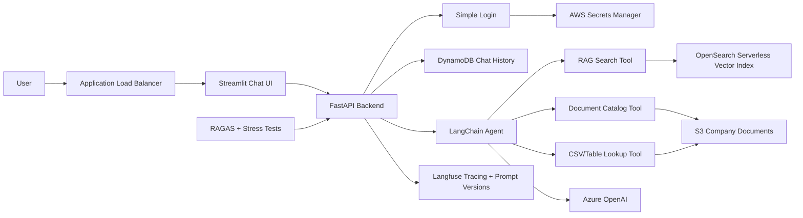

# Internal Company Knowledge Assistant Plan

## Summary
Build a five-day MVP for an internal company knowledge assistant with FastAPI, Streamlit, LangChain, Azure OpenAI, S3, OpenSearch Serverless, Langfuse, RAGAS, AWS Secrets Manager, simple login, persistent chat history, and ECS Fargate deployment.

## Architecture

## Core Tech Stack
- Backend: FastAPI, Uvicorn, Pydantic
- Frontend: Streamlit
- Agent framework: LangChain
- LLM: Azure OpenAI through `langchain-openai`
- RAG storage: Amazon S3 + OpenSearch Serverless
- Chat history: DynamoDB
- Secrets: AWS Secrets Manager
- Observability: Langfuse
- Evaluation: RAGAS, pytest, stress-test script
- Deployment: Docker, ECR, ECS Fargate, ALB, CloudWatch

## Agent Tools
1. RAG Search Tool: searches indexed company documents and returns grounded answers with citations.
2. Document Catalog Tool: lists and filters available documents by filename, department, type, date, or tags.
3. CSV/Table Lookup Tool: handles exact lookup questions from structured CSV files stored in S3.

## Acceptance Criteria
- User must log in before using chat.
- Chat history persists across refreshes and sessions.
- Follow-up questions use previous conversation context.
- Agent uses at least three tools.
- RAG answers include citations from S3 documents.
- All secrets come from AWS Secrets Manager.
- Each answer shows token usage, latency, tools used, and trace ID.
- Langfuse captures traces and prompt versions.
- RAGAS golden-data report is generated.
- 100-query stress-test report is generated.
- App runs locally with Docker and deploys to ECS Fargate.

